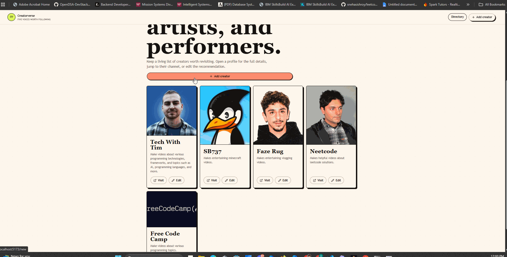

# WEB103 Prework - Creatorverse

Submitted by: **Abhi Hari**

About this web app: **Creatorverse is a React and Supabase app for collecting favorite content creators. Users can browse creator cards, view creator details, visit each creator's channel, add new creators, edit existing creators, and delete creators from the directory.**

Time spent: **6** hours

## Required Features

The following **required** functionality is completed:

<!-- Make sure to check off completed functionality below -->
- [x] **A logical component structure in React is used to create the frontend of the app**
- [x] **At least five content creators are displayed on the homepage of the app**
- [x] **Each content creator item includes their name, a link to their channel/page, and a short description of their content**
- [x] **API calls use the async/await design pattern via Axios or fetch()**
- [x] **Clicking on a content creator item takes the user to their details page, which includes their name, url, and description**
- [x] **Each content creator has their own unique URL**
- [x] **The user can edit a content creator to change their name, url, or description**
- [x] **The user can delete a content creator**
- [x] **The user can add a new content creator by entering a name, url, or description and then it is displayed on the homepage**

The following **optional** features are implemented:

- [ ] Picocss is used to style HTML elements
- [x] The content creator items are displayed in a creative format, like cards instead of a list
- [x] An image of each content creator is shown on their content creator card

The following **additional** features are implemented:

* [x] Responsive custom styling for desktop and mobile screens
* [x] Loading, empty, and error states for creator data
* [x] Optional image URL support on add and edit forms

## Video Walkthrough

Here's a walkthrough of implemented required features:

<!-- Replace this with whatever GIF tool you used! -->
GIF created with ScreenToGif
<!-- Recommended tools:
[Kap](https://getkap.co/) for macOS
[ScreenToGif](https://www.screentogif.com/) for Windows
[peek](https://github.com/phw/peek) for Linux. -->

## Notes

The app uses a Supabase table named `creators` with columns for `name`, `url`, `description`, and `imageURL`. The setup SQL is included in `supabase-setup.sql`. After creating the table, add at least five creators through the app or Supabase Table Editor so the homepage satisfies the prework requirement.

## License

Copyright [2026] [Abhi Hari]

Licensed under the Apache License, Version 2.0 (the "License"); you may not use this file except in compliance with the License. You may obtain a copy of the License at

> http://www.apache.org/licenses/LICENSE-2.0

Unless required by applicable law or agreed to in writing, software distributed under the License is distributed on an "AS IS" BASIS, WITHOUT WARRANTIES OR CONDITIONS OF ANY KIND, either express or implied. See the License for the specific language governing permissions and limitations under the License.
